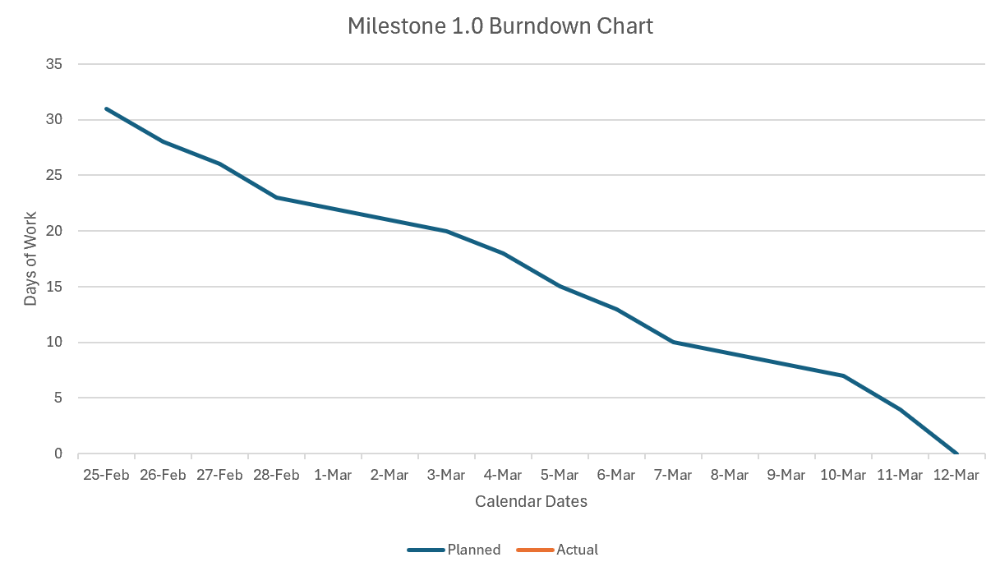

# Course
- IST 303: Software Development (Claremont Graduate University)
# Part A
## Project Name
- Medication Management and Error Reduction System
## Team D Members
- Ben Morehead
- Jade Sleiman
- Mark Villamayor
- Millicent Wanyeki
## Product
- The system is designed to significantly reduce medication errors in healthcare settings by effectively integrating real-time barcode scanning alerts related to prescription management, medication dispensements, and dangerous drug-drug interactions from the perspective of medical providers.
## Stakeholders
- **Patients**
  - Patients will be able to access personal medical histories and information of prescribed medications, in order to be more knowledgeable and aware of their own health.
- **Medical Providers**
  - Medical providers ensure patient health and safety through forming individualized medical histories, robust medication administration, and coordinating with fellow healthcare personnel.
- **Administrators**
  - Administrators ensure the integrity, security, and functionality of the overall system that best serves patients, medical providers, and themselves.
## Initial User Stories
*Patients*
1. As a patient, I want to be able to find links to additional information for potential side effects of prescribed medication so that I can know what to expect from its consumption. (Estimate: 1 day)
2. As a patient, I want to access my own individual medical history, alongside my personal history of previously prescribed medication disbursements, so that I am aware of my own current and preexisting conditions. (Estimate: 3 days)
3. As a patient, I want a messaging system that allows me to communicate with healthcare staff so that I can easily reach out to them for medical advice and guidance whenever necessary. (Estimate: 4 days)
4. As a patient, I want to receive dashboard alerts for missed medication and potential prescription renewals so that I can be proactive about my own health and medications. (Estimate: 2 days)
5. As a patient, I want to be sure all medications administered are verified through barcode scanning so that I know that I am receiving the correct treatment. (Estimate: 5 days)
6. As a patient, I want to log in to my own portal that features demographic characteristics of myself for a holistic profile, along with a dashboard of logging symptoms and displaying any diagnoses, so that there is transparency about myself and my health. (Estimate: 5 days)

*Medical Providers*
1. As a medical provider, I want links to information of potentially dangerous interactions between medications taken at the same time so that patients' health are not unknowingly endangered by such. (Estimate: 1 day)
2. As a medical provider, I want the system to automatically check for potential drug interactions at the point of prescribing, so that I can ensure the safety of my patients by avoiding harmful combinations. (Estimate: 3 days)
3. As a medical provider, I want to receive and send alerts for missed medication disbursements of given patients so that patients' prescribed medication treatments are not interrupted. (Estimate: 2 days)
4. As a medical provider, I want to be able to log in to my own portal with various functions including a messaging system between doctors and nurses for patient healthcare so that the most optimal care is prioritized. (Estimate: 7 days)
5. As a medical provider, I want to access notes from other healthcare personnel, so that no information is lost between personnel when changing shifts. (Estimate: 2 days)
6. As a medical provider, I want to access the database of patients' medical histories so that I can be aware of any current and preexisting conditions whenever necessary. (Estimate: 3 days)

*Administrators*
1. As an administrator, I want to implement 2FA into the system via email verification links after typing in a username and password, so that the security and integrity of the application are ensured. (Estimate: 3 days)
2. As an administrator, I want the system to automatically notify me when medication stock levels are low, so that I can reorder supplies before they run out. (Estimate: 4 days)
3. As an administrator, I want to make sure all administered medications are verified through barcode scanning so that patients are ensured to receive the correct treatment. (Estimate: 4 days)
4. As an administrator, I want to be able to receive compliance reports from medical providers and other administrators for auditing and internal purposes on a quarterly basis, so as to ensure the healthcare facility is regularly meeting regulation and safety standards. (Estimate: 5 days)
5. As an administrator, I want to assign various functional roles to different types of administrators on the application so that workloads and permissions are subdivided across roles. (Estimate: 3 days)
6. As an administrator, I want to implement a feedback system that allows all stakeholders to voice improvements and concerns so that the application can be dynamically improved. (Estimate: 3 days)
# Part B 
## Revised User Stories with corresponding Tasks
*Patients*
1. As a patient, I want to view my own individual medical history so that I am aware of how medical providers review my overall profile. (Estimate: 4 days)
    - Implement the database schema for the storage of patients' medical histories (1 day)
    - Develop the API to fetch individual medical history (1 day)
    - Build the UI for patient dashboard to display medical history (1 day)
    - Testing and debugging (1 day)
2. As a patient, I want to view my past and current medication prescriptions as well as receive dashboard alerts for missed medication and potential prescription renewals so that I can be proactive about my own health and medications. (Estimate: 5 days)
    - Implement the medication tracking database (1 day)
    - Develop the API to fetch current and past prescriptions (1 day)
    - Add a notification system for when the pick-up of medication has been missed and when a prescription renewal is required (1 day)
    - Build the UI for alert display (1 day)
    - Test notification system (1 day)
3. As a patient, I want to log in to my own portal that features demographic characteristics of myself for a holistic profile, along with being able to access my own medical history, so that there is transparency about myself and my health. (Estimate: 6 days)
    - Implement authentication system using JSON Web Token (2 days)
    - Develop the patient login UI (2 days)
    - Ensure that API endpoints are secured for authorized access (1 day)
    - Test logging in (1 day)

*Medical Providers*
1. As a medical provider, I want links to information of potentially dangerous interactions between medications taken at the same time so that patients' health are not unknowingly endangered by such. (Estimate: 2 days)
    - Find and store reliable/trusted online resources (0.5 days)
    - Add UI interactivity to view information of drug interactions (0.5 days)
    - Ensure that external links can correctly open and are accessible with no pop-ups (0.5 days)
    - Verify and test that the links contain accurate, valid, and up-to-date information (0.5 days)
2. As a medical provider, I want the system to automatically check for potential drug interactions at the point of prescribing, so that I can ensure the safety of patients by avoiding harmful combinations. (Estimate: 4 days)
    - Implement drug interaction API (1 day)
    - Develop API endpoint for interaction checks (1 day)
    - Build the UI to display warnings from the medical providers' point of view (1 day)
    - Test interaction detection accuracy (1 day)
3. As a medical provider, I want to receive and send alerts for missed medication dispensements of given patients, along with being able to log my own requests for medication restocks, so that patients' prescribed medication treatments are not interrupted. (Estimate: 4 days)
    - Implement a tracking system for medication dispensements (1 day)
    - Develop the API to send alerts about missed dosages and needing to restock (1 day)
    - Build the UI surrounding medical provider notifications (1 day)
    - Test the alert system (1 day)
4. As a medical provider, I want to be able to log in to my own portal with various functions including a messaging system between doctors and nurses for patient healthcare so that the most optimal care is prioritized. (Estimate: 8 days)
    - Implement medical provider authentication system (2 days)
    - Develop the provider login UI (2 days)
    - Incorporate secure messaging system between doctors and nurses (2 days)
    - Build the UI for messaging system (1 day)
    - Test provider login (0.5 days)
    - Test messaging system (0.5 days)
5. As a medical provider, I want to access notes from other healthcare personnel, so that no information is lost between personnel when changing shifts. (Estimate: 4 days)
    - Design the database schema for medical providers' notes (0.5 days)
    - Develop API endpoints for the management of notes (1 day)
    - Build the UI for viewing and adding notes (1 day)
    - Implement role-based access to view and edit notes (0.5 days)
    - Test note system functionality (1 day)
6. As a medical provider, I want to access and edit the database of patients' medical histories that includes past diagnoses, past and current medication prescriptions, and medical procedures among others so that there is a comprehensive profile of each patient. (Estimate: 4 days)
    - Implement medical provider permission system for history access (1 day)
    - Develop the API for editing patient records (1 day)
    - Build the UI for editing medical histories (1 day)
    - Test functionality of updating patients' records (1 day)
7. As a medical provider, I want to dynamically add, edit, and overall change the listings of medications that each have their own IDs and can be accessed via barcode scanning so that prescribed drugs can be correctly distributed to corresponsing patients. (Estimate: 6 days)
    - Implement CRUD functionality for medications (2 days)
    - Develop the API to update medication lists dynamically (1 day)
    - Build the UI for providers to change medications as needed (2 days)
    - Test update functions and permissions (1 day) 

*Administrators*
1. As an administrator, I want to implement 2FA into the system via email verification links after typing in a username and password, so that the security and integrity of the application are ensured. (Estimate: 4 days)
    - Incorporate email-based 2FA (2 days)
    - Build the UI for 2FA verification input (1 day)
    - Test authentication system (1 day)
2. As an administrator, I want to make sure all administered medications are verified through barcode scanning by being able to view this action from medical providers on my own end, so that I can double-check if it is indeed verified. (Estimate: 5 days)
    - Implement medication verification logging system (2 days)
    - Build the UI for administrators to review verification logs (2 days)
    - Test logging system (1 day)
3. As an administrator, I want to assign functional roles to patients, medical providers, and administrators on the application so that permissions are subdivided across roles according to their own corresponding purposes. (Estimate: 5 days)
    - Define user roles in the database (1 day)
    - Implement access control across application system (2 days)
    - Build the UI for administrators to manage user roles (1 day)
    - Test access restrictions of roles (1 day)
4. As an administrator, I want to implement a feedback system that allows all stakeholders to voice improvements and concerns so that the application can be dynamically improved. (Estimate: 4 days)
    - Implement database schema for feedback submissions (1 day)
    - Develop the API for sending and receiving feedback (1 day)
    - Build the UI for submitting and viewing feedback (1 day)
    - Test feedback submission and retrieval (1 day)
## Milestone 1.0 Features (32 work days available for completion)
- External Drug Interaction Information for Medical Providers (Medical Provider User Story #1)
- Automatic Drug Interaction Checks for Medical Providers (Medical Provider User Story #2)
- Medical Provider Login (Medical Provider User Story #4 without the messaging system)
- Medical Provider Barcode-Based Medication Management System (Medical Provider User Story #7)
- Administrator Implementation of 2FA (Administrator User Story #1)
- Administrator Medication Verification (Administrator User Story #2)
- Administrator Role-Based Access Control (RBAC) Management (Administrator User Story #3)
## Iteration 1 (Length: 16 Person-Days / Finish by 03/04 11:59PM)
- Calculation of Iteration Time:
  - Total Work Days Available (accounting for weekends and velocity):
    - Calendar days until deadline (as of 02/24): 15 days
    - Weekdays: 15 * 5/7 = 11 days
    - Available days: 11 * 0.7 (velocity %) = 8
    - Available days * 4 team members = 32 TOTAL WORK DAYS AVAILABLE
  - Iteration Work Capacity:
    - 32 days until milestone can be completed / 2 iterations = 16 person-days per iteration
    - 16 person-days per iteration / 2.8 (4 * 0.7) = 6 work days / iteration

- Features:
  - Medical Provider Login without Testing (4 days)
    - Implement medical provider authentication system (2 days)
    - Develop the provider login UI (2 days)
  - Automatic Drug Interaction Checks without Testing (3 days)
    - Implement drug interaction API (1 day)
    - Develop API endpoint for interaction checks (1 day)
    - Build the UI to display warnings from the medical providers' point of view (1 day)
  - Medical Provider Barcode-Based Medication System without UI and Testing (3 days)
    - Implement CRUD functionality for medications (2 days)
    - Develop the API to update medication lists dynamically (1 day)
  - Administrator Implementation of 2FA without Testing (3 days)
    - Incorporate email-based 2FA (2 days)
    - Build the UI for 2FA verification input (1 day)
  - Administrator RBAC Management Start without UI and Testing (3 days)
    - Define user roles in the database (1 day)
    - Implement access control across application system (2 days)
## Iteration 2 (Length: 16 Person-Days / Finish by 03/11 11:59PM)
- Calculation of Iteration Time:
  - 32 Total Work Days Available - Iteration 1 (16 days) = 16 person-days

- Features:
  - Medical Provider Login Testing (0.5 - 1 day)
  - External Drug Interaction Information for Medical Providers (2 days)
    - Find and store reliable/trusted online resources (0.5 days)
    - Add UI interactivity to view information of drug interactions (0.5 days)
    - Ensure that external links can correctly open and are accessible with no pop-ups (0.5 days)
    - Verify and test that the links contain accurate, valid, and up-to-date information (0.5 days)
  - Automatic Drug Interaction Check Testing (1 day)
  - Medical Provider Barcode-Based Medication System with UI and Testing (3 days)
    - Build the UI for providers to change medications as needed (2 days)
    - Test update functions and permissions (1 day)
  - Administrator Implementation of 2FA Testing (1 day)
  - Administrator Medication Verification (5 days)
    - Implement medication verification logging system (2 days)
    - Build the UI for administrators to review verification logs (2 days)
    - Test logging system (1 day)
  - Administrator RBAC Management Finish (2 days)
    - Build the UI for administrators to manage user roles (1 day)
    - Test access restrictions of roles (1 day)
## Task Allocation
**Ben**
- Medical Provider Barcode-Based Medication System without UI and Testing (3 days)
  - Implement CRUD functionality for medications (2 days)
  - Develop the API to update medication lists dynamically (1 day)
- Administrator RBAC Management (5 days)
  - Define user roles in the database (1 day)
  - Implement access control across application system (2 days)
  - Build the UI for administrators to manage user roles (1 day)
  - Test access restrictions of roles (1 day)

**Jade**
- Medical Provider Login Testing (0.5 - 1 day)
- External Drug Interaction Information for Medical Providers (2 days)
  - Find and store reliable/trusted online resources (0.5 days)
  - Add UI interactivity to view information of drug interactions (0.5 days)
  - Ensure that external links can correctly open and are accessible with no pop-ups (0.5 days)
  - Verify and test that the links contain accurate, valid, and up-to-date information (0.5 days)
- Automatic Drug Interaction Check Testing (1 day)
- Medical Provider Barcode-Based Medication System with UI and Testing (3 days)
  - Build the UI for providers to change medications as needed (2 days)
  - Test update functions and permissions (1 day)
- Administrator Implementation of 2FA Testing (1 day)

**Mark**
- Medical Provider Login without Testing (4 days)
    - Implement medical provider authentication system (2 days)
    - Develop the provider login UI (2 days) 
- Administrator Implementation of 2FA without Testing (3 days)
    - Incorporate email-based 2FA (2 days)
    - Build the UI for 2FA verification input (1 day)

**Millicent**
- Automatic Drug Interaction Checks without Testing (3 days)
  - Implement drug interaction API (1 day)
  - Develop API endpoint for interaction checks (1 day)
  - Build the UI to display warnings from the medical providers' point of view (1 day)
- Administrator Medication Verification (5 days)
  - Implement medication verification logging system (2 days)
  - Build the UI for administrators to review verification logs (2 days)
  - Test logging system (1 day)
## Milestone 1.0 Burndown Chart (as of 03/06)

## Tentative Meeting Schedule
- February 17, 2025 @ 8PM
- February 20, 2025 @ ~~8PM~~ 12PM
- February 24, 2025 @ 8PM
- ~~February 27, 2025 @ 8PM~~ *CANCELLED due to scheduling conflicts*
- March 3, 2025 @ 8PM
- March 6, 2025 @ 8PM
- March 10, 2025 @ 8PM

*Note: Unless otherwise noted, all meetings will be taking place over Zoom.*

## Meeting Agendas and Details
**Team Meeting 1 - 02/17**
- Agenda
  - Project Overview
  - Terminal/Git Recap
  - Task Allocation (*Postponed*)
  
- Check-In Question: What IDE are you using?
  - Ben: VS CODE
  - Jade: VS Code
  - Mark: VS Code
  - Millicent: VS code

- Meeting Summary: This was the first meeting where all four members were able to be present at the same time, which includes Ben Morehead, Jade Sleiman, Mark Villamayor, and Millicent Wanyeki. As such, an overview of the project was briefly covered, which mainly consisted of being familiar with navigating the corresponding repository in GitHub and reviewing the information within it. After that, a quick recap of terminal and Git commands was conducted to ensure that everyone is on the same page in regard to navigating project directories and files in general. In order to gauge everyone's familiarity with terminal and Git commands, ensure that the repository is cloned onto local machines, and do a check-in from each member of the team for this meeting, a simple check-in question was asked that would have to be answered by each person via editing the README file. Obstacles to doing so ensued among the team, leading to task allocation being delayed to the next meeting partially because of this. Adjustments to timeline progress and a follow-up on terminal/Git commands may be necessary.

**Team Meeting 2 - 02/20**
- Agenda
  - Check-In Question / Follow-Up to Terminal & Git Command Familiarity
  - Review of Team Project: Part A Feedback
  - Rework of User Stories and Initial Discussion of Features/Task Allocations
  - Next Meeting: ~~Professor Feedback on Part B Requirements before Submission,~~ Development & Testing Environment Set-Up, and Potential Milestone 1.0 Start
  
- Check-In Question: Were you able to look over the Part A feedback on your own this week?
  - Ben: Yes, I did and realized we overlooked the part about meeting with the professor.
  - Jade: Yes.
  - Mark: Yes.
  - Millicent: Yes I went through the professors comments.

- Meeting Summary: Although the original meeting time was changed and some schedules had to be reworked because of this, Ben, Jade, Mark, and Millicent were all able to make it and be present for this meeting. As a start, in order to follow up on familiarity with the terminal and Git from the last meeting while also checking to see if anyone was able to look over the Part A feedback on their own, a check-in question was asked about the latter which had to be answered via editing the README file, where there was significant improvement in doing so but some practice was still needed among the team. Regardless, we reviewed the Part A feedback together so that we were on the same page about it, which led to reworking and refining the product, stakeholders, and user stories because of it. In turn, we had an initial discussion about features and task allocations being changed as well. By the end of the meeting, we decided that, although it would be helpful to get feedback before submitting Part B, we did not feel like we would have everything ready by then in terms of setting up the development and testing environment as well as including everything in the README, so we decided to go ahead and spend time on our own to work on it after the meeting was over in preparing to start Milestone 1.0.

**Team Meeting 3 - 02/24**
- Agenda
  - Team Project: Part B Draft Review
  - Development & Testing Environment Set-Up
  - Next Meeting: Iteration 1 progress check

- Check-In Question: Which features/tasks are you doing for Milestone 1.0?
  - Ben: Medical Provider Barcode-Based Medication System without UI and Testing (3 days), Administrator RBAC Management Start without UI and Testing (3 days), Administrator RBAC Management Finish (2 days)
  - Jade: Test Cases after code is completed (2 days)
  - Mark: Medical Provider Login (5 days) and Administrator Implementation of 2FA without Testing (3 days) 
  - Millicent: Automatic Drug Interaction check-test,medication verification

- Meeting Summary: Everyone was present for this meeting, except for Jade who was absent due to a scheduling conflict. In this meeting, we went over a rough draft of Part B which included the revised user stories with all of their tasks, the iterations that would be conducted for Milestone 1.0, and deciding which tasks should be assigned to each member of the team. From there, we went over setting up the development and testing environment together, which meant changing the repository for it and including software like mySQL, Django, and JSON. Additional set-up and work was needed after this meeting, but there was enough to start working on Iteration 1 of Milestone 1.0 this week and we knew that we would have follow up on each other's progress in the next meeting.

**Team Meeting 4 - 03/03**
- Agenda
  - Check-Up on Iteration 1 Team Progress
    - ~~Update Milestone 1.0 burndown chart and visualize progress~~
  - ~~Task Assistance / Collaboration~~
  - Next Meeting: Overall review of Iteration 1 + Iteration 2 progress check

- Meeting Summary: Only two people were present for this meeting, namely Jade and Mark, while Ben and Millicent were absent for some unknown reason. Originally, we were going to have a team meeting on 02/27 last week to initially check up on everyone's progress toward Iteration 1, but the continuous delay of the meeting time ultimately led to the meeting's cancellation itself by the end of the week which postponed much of the agenda planned to today. At any rate, the planned agenda for this meeting was unlikely to be much different from what was planned for last week unless something specific came up that needed to be addressed, so this meeting would have been a continuation from the previous one in checking on everyone's progress. Speaking of which, since there was only two people for this meeting with one of them not having any tasks for this first iteration, we opted to postpone going into detail about our overall progress for this project until the next meeting where more of us are hopefully able to be present by then to discuss both iterations for this first milestone. This also meant postponing any assistance/collaboration for any task that proved to be challenging, along with updating the milestone burndown chart, until the next meeting.

**Team Meeting 5 - 03/06**
- Agenda
  - Check-Up on Iteration 1 and 2 Team Progress
    - Update Milestone 1.0 burndown chart and visualize progress
  - Task Assistance / Collaboration
  - Next Meeting: Progress check of Milestone 1.0 and potential presentation practice

- Meeting Summary: Nearly everyone in our team was able to make it for this meeting, except for Jade who could not. As it is stated in the agenda above, we did a check-up on everyone's progress toward the two iterations of Milestone 1.0, in which we agreed that more progress needed to be made over the weekend to stay on track for what we had originally planned for this milestone as shown in our project burndown chart. After that, we collaborated with each other in clarifying how to complete the tasks as well as assisted each other in completing them. Overall, moving forward from this meeting, we plan to do a progress check of Milestone 1.0 as a whole in the next meeting, along with potentially practicing how to present our work so far as well after discussing how to organize and structure ourselves for such.

**Team Meeting 6 - 03/10**
- Agenda
  - Check-up on Milestone 1.0 Team Progress
    - Update Milestone 1.0 burndown chart and visualize progress
  - Discussion of class presentation details and delivery preparation
  - Task Assistance / Collaboration

- Check-In Question: Were you able to look over the class announcement about how our presentations are to be conducted on Wednesday?
  - Ben: Yes, I have looked over how to present our work.
  - Jade: Yes, and I have looked over the professor's notes and recommendations about how to present our work.
  - Mark: Yes, and I also met with Professor David during his office hours to discuss it as well.
  - Millicent:Yes i  looked at the professors recommendation on the presentantion.
